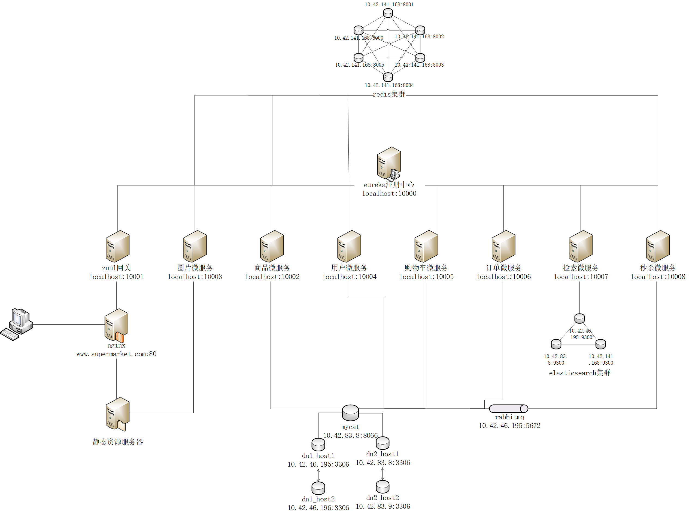
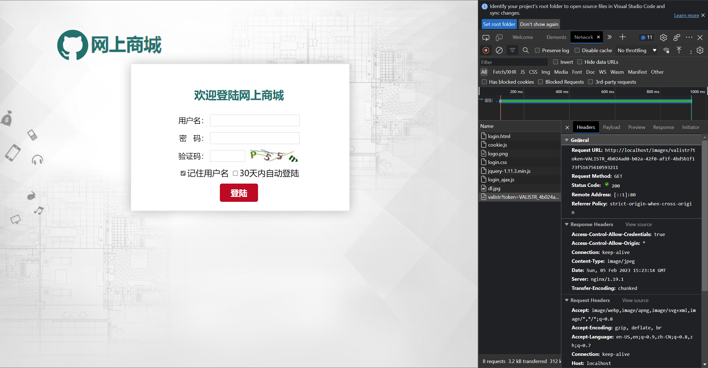
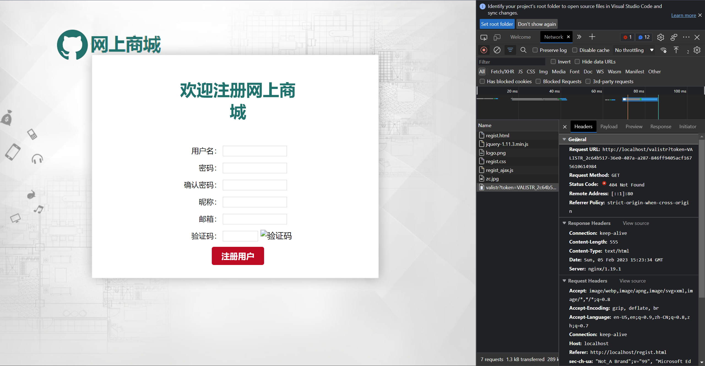

# Overview
Instrumented Repo: https://github.com/CornDavid5/SuperMarket
Commit: 7daf9fa1c7e0708cd8a69cbac1eafafd817918eb

This project consists of a lot services, which can be visualized in following graph:

# How to Deploy
Prerequisite:
- Java 11

Deploy Step:
- clone my instrumented repo, run `git clone git@github.com:CornDavid5/SuperMarket.git`
- build all docker containers, run `mvn clean package -Dmaven.test.skip=true`
    - note: you may want to comment the `<url>` in pom files, because it is point to a maven repository mirror server in China, the download speed is very slow.
- go to start up script folder, run `cd start_up`
- start docker containers, run `./mysql/start_mysql.sh && ./redis/start_redis.sh && ./elasticsearch/start_es.sh && ./app/start_app.sh`
    - during the start up, you may need to manually answer two prompts, one asks you to type `yes` for redis to configure replica, other one asks you to input your user password to set up VM maximum memory.

After the services is started, you can access the program in following url:
- http://localhost:80 for user frontend
- http://localhost:10000/ for service discovery
- http://localhost:10002/swagger-ui/ for product service API doc
- http://localhost:10003/swagger-ui/ for image service API doc
- http://localhost:10004/swagger-ui/ for user service API doc
- http://localhost:10005/swagger-ui/ for cart service API doc
- http://localhost:10006/swagger-ui/ for order service API doc
- http://localhost:10007/swagger-ui/ for search service API doc
- http://localhost:10008/swagger-ui/ for instant_buy service API doc

I cannot interact with many service through the frontend due to the issue mentioned in the `Note` section, but I can use the internal API to directly query the backend services.

# How to Run Test
There is total two unit tests in the entire project. And Both of them simply print out result from a local function call, no assertion used.

# Note
- in the original `start_mysql` script, when running cp command, the author forgot to use -r flag, which will cause error
- in the original `start_mysql` script, when running the `docker exec dn1_host1 mysql -uroot -proot -e "show slave status;start slave;"`, it will give you `ERROR 1872 (HY000): Slave failed to initialize relay log info structure from the repository` error, solution is run `RESET SLAVE;` before change master settings.
- some logic error may be in the source code, for example, in the homepage, `adv_l1.jpg` is loaded while `adv1.jpg` is not loaded. Both pictures have the correct url, and they existed in the same folder, I don't know why one is blocked.

- the register user website still using old verification code API, so no verification code display
    - `http://localhost/valistr?token=` should be `http://localhost/images/valistr?token=`
    
    
- many API requests are hard coded using `www.supermarket.com` as prefix, you may need to set up DNS record in your system.