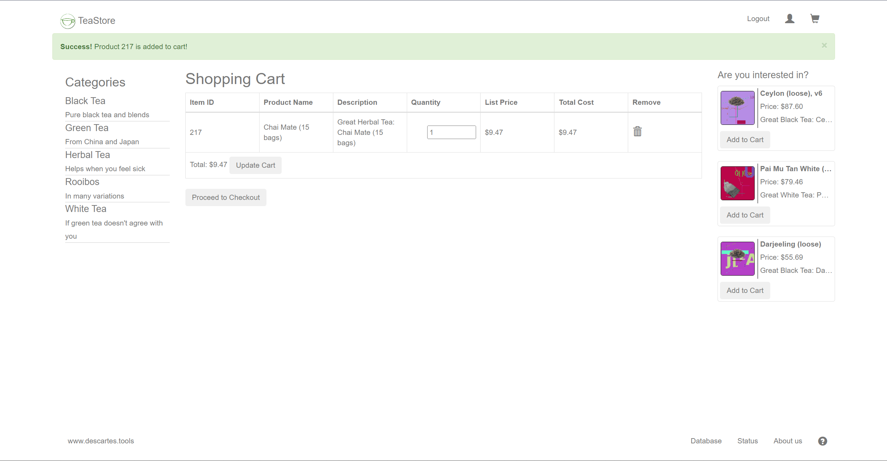
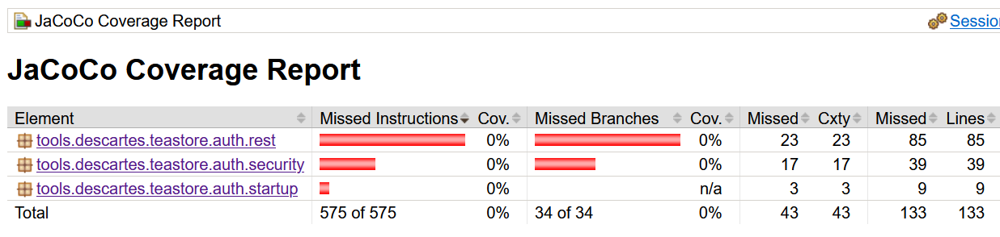

# Overview
Instrumented Repo: https://github.com/CornDavid5/TeaStore
Commit: 4bea6b2e3e0cc1ea592ced988084cbccf0de4e30

This project consists of five main services:
- WebUI Service
- Authentication Service
- Recommender Service
- Persistence Provider Service
- Image Provider Service

The interaction between services is done by REST API call facilitating by a service registry.

# How to Deploy
Prerequisite:
- Java 11

Deploy:
- clone my repo, run `git clone git@github.com:CornDavid5/TeaStore.git`
- running the project without monitoring, run `docker compose -f ./examples/docker/docker-compose_default.yaml up -d`
- to access the UI, visit `http://localhost:8080/tools.descartes.teastore.webui`

# How to Run Unit Test
Only `Authentication Service`, `Recommender Service`, `Persistence Provider Service`, and `Image Provider Service` provide tests.

Steps:
- clone my repo, run `git clone git@github.com:CornDavid5/TeaStore.git && cd TeaStore`
- run `mvn test -pl services/tools.descartes.teastore.image -am`
- run `mvn test -pl services/tools.descartes.teastore.persistence -am`
- run `mvn test -pl services/tools.descartes.teastore.recommender -am`
- run `mvn test -pl services/tools.descartes.teastore.auth -am`

Note: If you run `mvn test`, you will encounter `Artifact has not been packaged yet. When used on reactor artifact, copy should be executed after packaging: see MDEP-187` error. There is still an open ticket in the [maven-dependency-plugin](https://issues.apache.org/jira/browse/MDEP-187), the potential cause is stated in [here](https://stackoverflow.com/questions/26101135/artifact-has-not-been-packaged-yet-maven-dependency-plugin). However, the problem module is an utility module with no real test, so it should be fine.

## Unit Test Coverage
Coverage report for those four testable modules could be found in [here](./unit-coverage/). The tests don't cover many of the user cases, the resulting coverage is not so high.

# How to Run Integration Test
Integration tests can be found in [here](https://github.com/CornDavid5/TeaStore/tree/integration-test/e2e-tests/cypress/integration)

Steps:
- clone my repo, run `git clone git@github.com:CornDavid5/TeaStore.git && cd TeaStore && git checkout integration-test`
- Go to the end-to-end test directory, run `cd e2e-tests`
- Install dependencies, run `npm install`
- Start application, run `docker compose -f ../examples/docker/docker-compose_default.yaml up -d`
- Run tests, run `npm run cy:run`
    - If you encounter `Passthrough is not supported, GL is swiftshader` error, run `npm run cy:run --disable-features=DefaultPassthroughCommandDecoder`

## Integration Test Coverage (Failed Attempt)
Prerequisite:
- Java 11

The following steps are what I have tried to generate the coverage report using Jacoco.

Jacoco framework provides Jacoco Agent to dynamically extract the coverage information during the runtime. Jacoco agent needed to be hooked into the JVM to achieve runtime coverage report.

To provide the Jacoco agent to our services, there are two ways.
- Copy the jacocoagent.jar directly into the service docker container
- Start a jacoco agent docker container and mount a volume of the jacoco agent container into every other service container

I used the second approach, you can find the docker compose file in [here](https://github.com/CornDavid5/TeaStore/blob/integration-coverage/examples/docker/docker-compose_default.yaml).

Because this project uses Tomcat to host our web application for each service, and to use Jacoco with Tomcat, we have to instrument the `catalina.sh` file in the Tomcat binary files folder, `/usr/local/tomcat/bin`, therefore, we have to modify the provided dockerfiles in each service.

The original dockerfile for each service inherits from a base docker image, `descartesresearch/teastore-base:latest`, however, this docker image will start the Tomcat server before the instrument. Therefore, I remove the CMD command, which starts the Tomcat server, from this base image to the service image. Check out the example in [here](https://github.com/CornDavid5/TeaStore/blob/integration-coverage/services/tools.descartes.teastore.auth/Dockerfile) and [here](https://github.com/CornDavid5/TeaStore/blob/integration-coverage/utilities/tools.descartes.teastore.dockerbase/Dockerfile)

The instrument is simple, we just need to pass one additional JVM parameters, `-javaagent` to the Tomcat server. To achieve so, we add one line into the `setenv.sh` file. Check out example in [here](https://github.com/CornDavid5/TeaStore/blob/integration-coverage/services/tools.descartes.teastore.auth/Dockerfile#L4). This parameter basically tells Jacoco to monitor all the class and output a file named `auth.exec` in the `/jacoco-report` folder.

Because we modified the docker file, we have to rebuild the docker image locally and use the local docker image for our deployment instead of the original ones in the Docker Hub.

To build the docker image, for example the auth service:
- go to the base image folder, run `cd utilities/tools.descartes.teastore.dockerbase`
- build the docker image, run `docker build --no-cache -t teastore-base:local .`
- go to the auth service folder, run `cd services/tools.descartes.teastore.auth`
- build the docker image, run `docker build --no-cache -t teastore-auth:local .`
- modify the docker compose file, check out example in [here](https://github.com/CornDavid5/TeaStore/blob/integration-coverage/examples/docker/docker-compose_default.yaml#L30)
- go back to the root folder and start docker containers, run `docker compose -f ./examples/docker/docker-compose_default.yaml up -d`

After all services is up, access the UI, visit `http://localhost:8080/tools.descartes.teastore.webui`, tried different interactions with the UI related to the authentication, for example, log in and log out.

For Jacoco to generate the coverage report, we have to gracefully terminate the java program. The `docker compose down` method doesn't work, the only way I found workable with this project is to run the provided `shutdown.sh` script in the Tomcat binary file folder:
- found the container name using `docker ps`
- ssh into the container, run `docker exec -it docker-auth-1 bash`
- go the Tomcat binary file folder, run `cd bin`
- gracefully shutdown server, run `shutdown.sh`
- wait for couple second, the container will shut down itself

After the service is down, we should see a file named `auth.exec` generated under `/examples/docker/jacoco-report` 

To generate html from this file:
- first we have to get the jacoco tool, we can download `jacoco-0.8.8.zip` from the [website](https://www.jacoco.org/jacoco/) and unzip it into any folder of your choice
- run `java -jar jacococli.jar report ../../TeaStore/examples/auth.exec --classfiles ../../TeaStore/services/tools.descartes.teastore.auth/target/classes/ --html ../../TeaStore/report/`
    - change the paths in this command to match your setup

However, I got no match and zero coverage for the service

Reference:

https://docs.teamscale.com/howto/recording-test-coverage-for-java-with-docker/#prerequisite-generate-git-properties

https://hub.docker.com/r/ictu/jacoco-agent-docker

https://github.com/piczmar/maven-jacoco-remote

https://help.liferay.com/hc/en-us/articles/360018162411-JaCoCo-Code-Coverage-Example#setenvbat-jacoco-settings