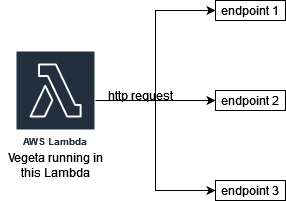

## Death-Star
Death Star is a project to perform load testing against multiple endpoints. It is basically a wrapper around `aws go SDK` and `vegeta`.

Source Repository: https://github.com/djmgit/DeathStar

Note:
- This project currently only support `AWS Lambda` as computation backend, which prevent me from running it as I used up all my AWS free trial.
- This project currently only support GET method for http request.
- Attack target has to be a public endpoint.
- All attack is done sequentially.

## Task 1 & Task 2
Because this project relies on the `AWS Lambda` for carrying out the attack and `AWS Lambda` is managed service, the microservice used in `AWS Lambda` is an implementation detail. Generally speaking, `AWS Lambda` will start a EC2 instance and run a `Amazon Linux` container in that instance. Then it will copy the uploaded zip package into that container and start running the program inside of the zip package. Therefore, the name of the microservices and the number of microservices started by `AWS Lambda` are unknown to us.

The interaction between microservices is also unknown to us, because what kind of the microservices running on the target endpoints is unknown.

`vegeta`, which is a load testing framework, will spin up goroutines to run the attacks concurrently, but it is not in separate container. Since the http body sent by `vegeta` is based on the configuration file user provided, the information passed on the httprequest is also unknown to us before runtime.

## Task 3
The interaction graph can be conceptualized as following:

