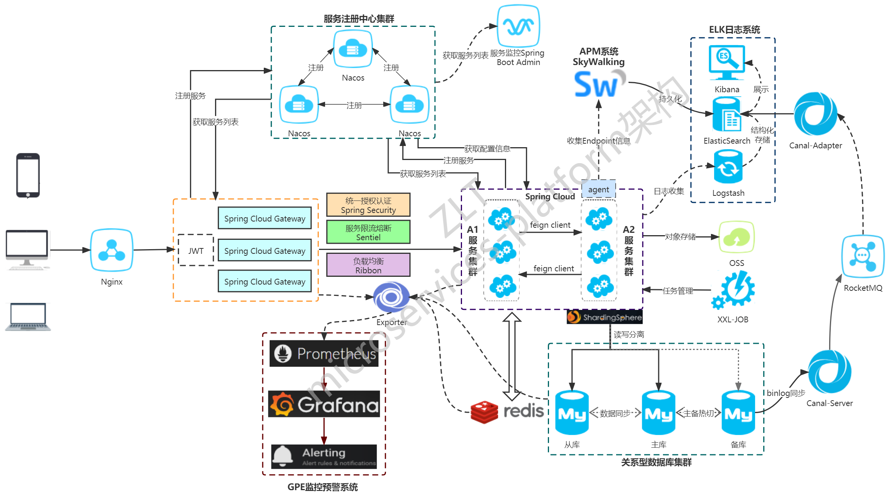

# Overview
Repo: https://github.com/zlt2000/microservices-platform
Commit: 610e17eb01f487100f58f6454f341a50feb8842d

This project consists of a lot services, which can be visualized in following graph:

For this project I only focus on the core services, such as database, service discovery, and a few business logic related services.

# How to Deploy
Prerequisite:
- Java 8
- Maven 3

The project does not provide scripts for deployment, the documentation literally states that download the dependency and set them up properly, which is not so helpful.

Deployment Steps:
- install and start mysql, redis, nacos, nodejs. You can find installation instruction in [here](https://dev.mysql.com/doc/mysql-installation-excerpt/5.7/en/), [here](https://redis.io/docs/getting-started/installation/), [here](https://github.com/alibaba/nacos), [here](https://nodejs.org/en/docs/).
- update the configuration file in [here](https://github.com/zlt2000/microservices-platform/blob/master/zlt-config/src/main/resources/bootstrap.properties), and [here](https://github.com/zlt2000/microservices-platform/blob/master/zlt-config/src/main/resources/bootstrap.properties) to match you machine's hostname. If you deploy locally, you can use `127.0.0.1`
- compile the module, run `mvn clean package -Dmaven.test.skip=true`
    - note: you may want to comment the `<url>` in the pom file, because it is point to a maven repository mirror server in China, the download speed is very slow.
- start authentication service, run `cd zlt-uaa/target && java -jar zlt-uaa.jar`
- start user service, run `cd zlt-business/user-center/target && java -jar user-center.jar`
- start gateway service, run `cd zlt-gateway/sc-gateway/target && java -jar sc-gateway.jar`
- start frontend ui, run `cd zlt-web/react-web/src/main/frontend && npm start`

Once core infrastructure starts, you can visit frontend via `http://localhost:8066`

# How to Run Test
After start up the infrastructure, run `mvn test`.

There are a few tests that fails because of connection issue, I think it have to do with my local DNS set up, need more time to investigate.