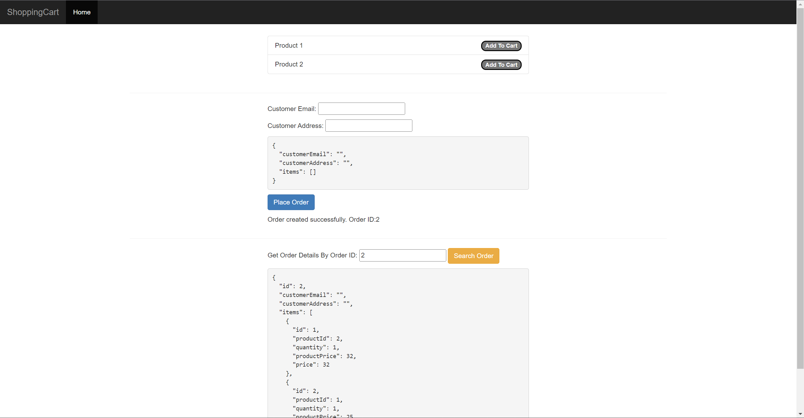

# Overview
Repo: https://github.com/sivaprasadreddy/spring-boot-microservices-series
Commit: 22a26a17d1a1f91f70e79f2b1cde334ac207be8b

This project consists of multiple services:
- `catalog-service`, `inventory-service`, and `order-service` services are core business logic services.
- `config-server` service provides configuration storage.
- `hystrix-dashboard` service monitors the circuit break in other service.
- `oauth2-server` service provides authentication.
- `service-registry` provides service discovery.
- `shoppingcart-ui` service provides a front-end.
- `zipkin-server` service provide a visualization of log files.

Core business logic services communicate with each other via REST API call.

# How to Deploy
Prerequisite:
- Java 8
- docker-compose
    - if you are using docker compose v2, you need to modify `run.sh` to change `docker-compose` to `docker compose`

To compile all service and start everything in docker, run `./run.sh start_all`

After docker containers are up, you can access the program in following url:
- http://localhost:8080 for frontend ui
- http://localhost:8761 for services discovery



# How to Run Test
There is no real test in this project, all service just includes empty test, which will load the service but do nothing, for example:

``` java
@RunWith(SpringRunner.class)
@SpringBootTest
public class OrderServiceApplicationTests {

	@Test
	public void contextLoads() {
	}

}
```

# Note
- hystrix doesn't work due to connection refuse issue, there is an open issue in the github, check [here](https://github.com/sivaprasadreddy/spring-boot-microservices-series/issues/13)