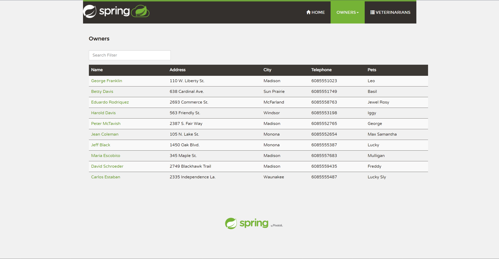

# Overview
Instrumented Repo: https://github.com/CornDavid5/spring-petclinic-microservices

Commit: c67949f9a419f062fd2b22ab48e7dcd8326401e6

This project has following architecture:

I will focus on the core components for deployments and testing, while ignore additional features, like distributed logging and monitoring.

# How to Deploy
This project provides docker images, we can deploy them using `docker compose`:
- (optional) build the packages, run `./mvnw clean install -P buildDocker`
    - note: Java 17 is required
- start docker containers, run `docker compose up`
- check the service discovery in `http://localhost:8761/` here to make sure all service is available
- you can access the frontend UI in `http://localhost:8080`

Note: by default the program uses a in-memory database, however, with a few modification, it is possible to run a standalone database, like mysql.

# How to Run Test
Prerequisite:
- Java 17

To run all tests, run `./mvnw clean test`

# Coverage
Prerequisite:
- Java 17

Steps:
- clone my instrumented repo, run `git clone git@github.com:CornDavid5/spring-petclinic-microservices.git`
- run all tests, run `./mvnw clean test`
- you can find coverage report for core components in their respective folder and under `target/jacoco-ut` folder

Or, you can find the generated coverage in [here](./coverage/)